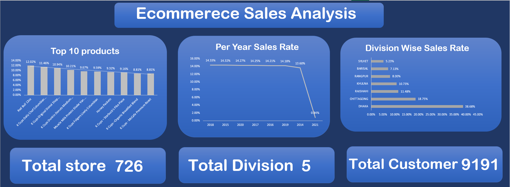
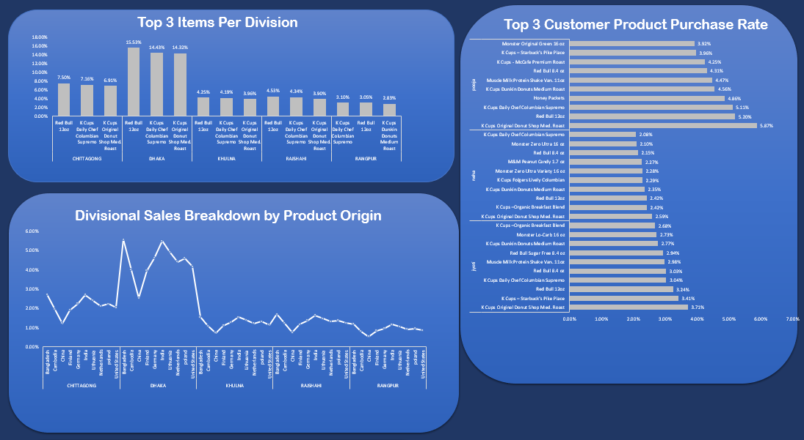
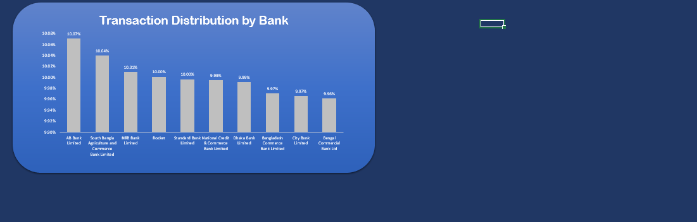

# E-commerce Sales Analysis Dashboard using Microsoft Excel

### Live Dashboard Preview

---

## 📖 About the Project

This project presents a comprehensive sales analysis of an e-commerce dataset. The primary objective was to transform raw sales data into an interactive and insightful dashboard. This dashboard helps in identifying key performance indicators (KPIs), understanding sales trends, product performance, customer behavior, and regional distribution of sales.

---

## 🎯 Problem Statement

The main goal of this analysis is to answer critical business questions that can help in strategic decision-making. These questions include:
- What are the top-selling products and their overall contribution to sales?
- How do sales trends evolve over the years?
- Which geographical divisions are the top revenue generators?
- What is the sales performance of products based on their country of origin in different divisions?
- Who are the top customers, and what are their most frequently purchased products?
- What are the most popular payment methods (Banks/MFS) used by customers?

---

## 🛠️ Tools & Technologies Used

- **Microsoft Excel:**
  - **Power Query:** For data extraction, cleaning, and transformation (ETL process).
  - **Power Pivot & Data Model:** To create relationships between different tables (Fact & Dimensions), building a robust Star Schema.
  - **DAX (Data Analysis Expressions):** To create calculated columns and measures for advanced analytics (e.g., calculating Profit, Month Name from dates).
  - **PivotTables & PivotCharts:** For data aggregation, summarization, and visualization.
  - **Slicers & Timelines:** To make the dashboard interactive and user-friendly.

---

## 📊 Key Insights & Findings

From the dashboard, we can derive the following key insights:

1.  **Overall Performance:** The **Dhaka** division is the undisputed market leader, contributing to **38.68%** of the total sales.
2.  **Top Products:** Products like **Red Bull** and various **K-Cups coffee** brands are consistently among the top 10 best-sellers.
3.  **Sales Trend:** The business showed stable year-on-year sales from 2018 to 2021, but there was a significant drop in the most recent year, which requires further investigation.
4.  **Product Origin Analysis:** While products from various countries are sold, items manufactured in **Bangladesh** and **India** show strong sales figures, especially in the Dhaka division.
5.  **Payment Methods:** The payment gateway landscape is highly competitive. Traditional banks like **AB Bank** and **South Bangla Agriculture Bank** lead slightly, but their market share is almost identical to other major banks and MFS like **Rocket**, indicating a diverse customer preference.

---

## ✒️ Author

- **Ahnaf Shahadat Taseen**
- **LinkedIn:** https://www.linkedin.com/in/ahnaf-shahadat-taseen-1b738a242/
- **GitHub:** https://github.com/Ahnaf-Shahadat-Taseen
